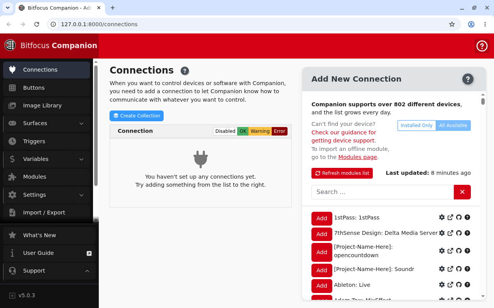

# companion-play user guide

companion-play is **a replacement OS for the BirdDog PLAY** that turns it into a self-contained
[Bitfocus Companion](https://bitfocus.io/companion) appliance: the server, its web UI on the HDMI
output, and USB surfaces on the front port.

> ### ⚠️ Early beta
>
> **Treat this as a design that boots on paper.** The image builds and the software stack is proven
> on the right CPU architecture — Companion has been started on aarch64 Linux with the full offline
> module bundle, all 811 modules enumerated, admin UI answering, surface plugins running — but
> **no part of this has ever run on BirdDog PLAY hardware.** The display, the installer and the USB
> surface path are unverified.
>
> **Do not put this on a unit you need for a show.**
>
> This codebase was created with AI assistance, directed and reviewed by a human author.

> **This is not a BirdDog or Bitfocus product.** Neither company is affiliated with it, endorses it
> or supports it. **Installing it voids your warranty and removes the NDI and SRT decoding the
> device was sold to do.**

---

## Why a PLAY

**Not for the silicon** — Companion uses none of the PLAY's video hardware.

The reason is **supply**: PLAYs turn up cheap in quantity, and one is a fanless, metal-cased
aarch64 box with HDMI, gigabit Ethernet and USB host. That is the shape of a Companion appliance,
and better packaged than a single-board computer in a case.

The one thing the hardware *does* buy is the **HDMI output**. Companion Pi is headless and its
screen shows nothing. **Here the display is part of the product**: the unit drives a monitor
showing Companion's own web UI and its web-button pages as tabs, so it is both the server *and* an
operator surface.

The display is deliberately **not kiosk mode** — the operator keeps the tab strip, so web-button
pages can sit alongside the admin UI.

---

## What it runs

| Piece | What |
|---|---|
| Base | A pinned, checksummed Debian-based minimal image |
| Companion | The **official** `linux-arm64` build. **Nothing compiles.** |
| Modules | The official offline module bundle, licence-filtered, preloaded — **no internet needed to be useful** |
| Display | Bare X + openbox + Chromium |
| Input | USB keyboard, mouse, touchscreen and Stream Decks — **via a powered hub** |

Companion's Linux build ships its own runtimes and native prebuilds, so the base OS supplies
libraries only.

---

## The install model, and what it preserves

**Only `boot` and `rootfs` are replaced.** The bootloader, trust, misc and **recovery** partitions
stay stock — **so Rockchip recovery mode *and* the vendor recovery partition both survive**, and
the device can be returned to factory firmware.

**`userdata` holds Companion's config, database, logs and any modules you add**, so **reflashing
the rootfs to upgrade Companion does not wipe your configuration.**

If the PLAY's microSD slot turns out to be physically fitted — **still an open question** — you can
run entirely from a card and never touch the internal storage.

---

## Two modes, one image

- **server** (default) — the full Companion host, admin UI on port 8000.
- **satellite** — Companion Satellite, driving this unit's surfaces from a Companion running
  elsewhere. **Scaffolded, not verified**: the switch **refuses unless the binary is present**,
  rather than stopping the server and starting nothing.

---

## Change the password

Released images ship with a **default password**, which is the only thing that makes a published
image usable by anyone but its builder.

**Change it on first login.** If you are building your own image, put a public key in the build's
secrets directory and clear the default-password setting for a **key-only image with no password at
all** — the right shape for anything going on a show network.

---

## Known limits

- **2 GB of RAM is the real constraint.** Companion idles at ~509 MB with zero connections, and
  **every connection is another child process.** Chromium is on top of that. **No connection count
  has been measured; do not assume one.**
- **One USB-A port.** Keyboard, mouse, touchscreen and a Stream Deck all want it, so **a
  self-powered hub is required.** The port's current budget has not been measured, and **a
  bus-powered hub with a Stream Deck on it is exactly the case that fails.**
- **Nothing has run on hardware.** Repeated because it matters.

---

## If something is wrong

| Symptom | Cause |
| --- | --- |
| **A Stream Deck drops off** | Bus-powered hub. Use a self-powered one; the port's budget is unmeasured. |
| **Companion becomes unresponsive as connections are added** | 2 GB, one process per connection, plus Chromium. |
| **Satellite mode refuses to start** | The binary is not present. It refuses rather than leaving you with nothing running. |
| **I want the PLAY back** | The vendor recovery partition and Rockchip recovery mode are both untouched. |
| **Upgrading wiped my config** | It should not — configuration lives on `userdata`, which reflashing the rootfs does not touch. |
